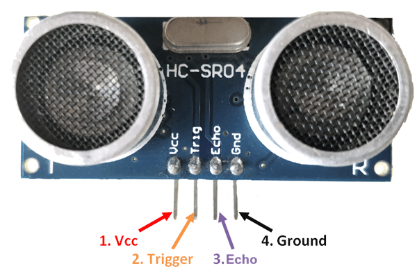
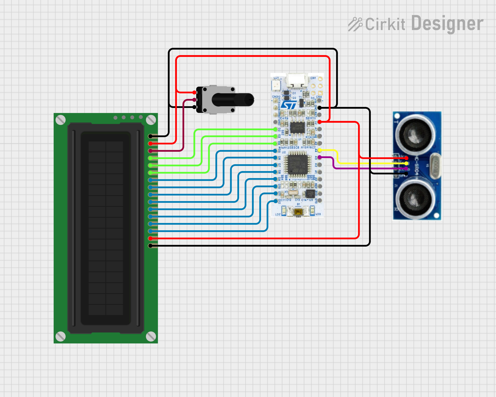

# Inteligentný parkovací asistent

**Hardvér:**

- STM32F303K8TX

- Ultrazvukový senzor vzdialenosti HC-SR04

- Display LCD 16 x 2

- Bzučiak VYS7940

- RBG LED

**Ciele:**

Cieľom projektu je návrh a realizácia parkovacieho asistenta, ktorý meria vzdialenosť vozidla od prekážky pomocou ultrazvukového senzora a túto informáciu poskytuje vodičovi prostredníctvom LED indikácie a zvukovej signalizácie. Taktiež bude vypísaná nameraná vzdialenosť senzora na displeji. 

## Meranie vzdialenosti

Na meranie vzdialenosti je použitý ultrazvukový senzor HC-SR04. Funguje na princípe vysielania zvuku v pred, ktorý sa odráža od okolitých objektov. Senzor následne počúva návrat ozveny od objektu. Podľa toho koľko dlho trvalo ozvene prejsť od senzoru k objektu a naspäť, vieme vypočítať v akej vzdialenosti sa objekt nachádza. 

## Piny HC-SR04 senzora

## Schéma zarpojenia periférií

